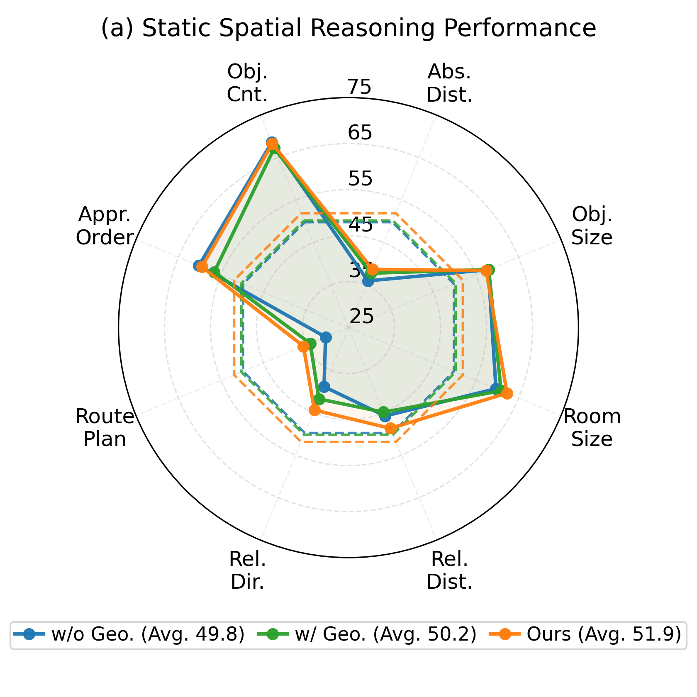
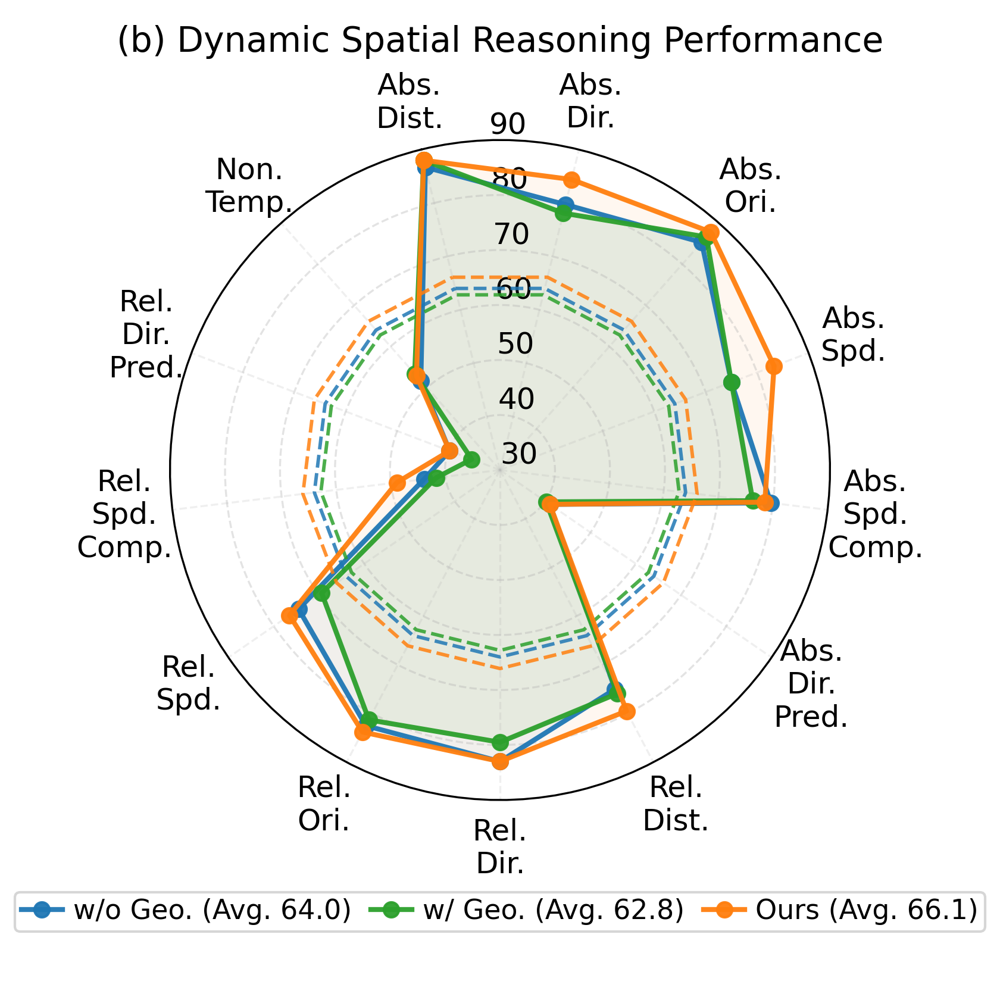
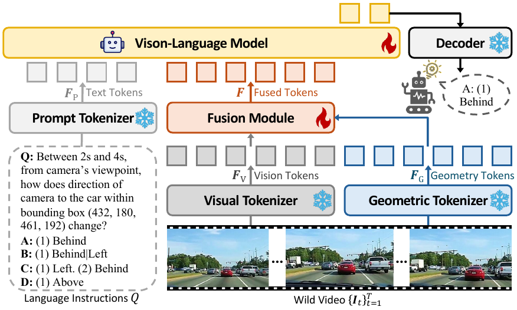
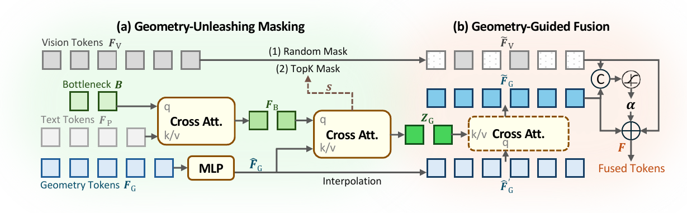

# GeoSR: Make Geometry Matter for Spatial Reasoning

<div align="center">
  <a href="https://github.com/SuhZhang/GeoSR" target="_blank">
    
  </a>
  <a href="https://suhzhang.github.io/GeoSR/" target="_blank">
    
  </a>
</div>

<div align="center">
  <a href="mailto:suhzhang001@gmail.com">Shihua Zhang</a>,
  <a href="mailto:qiuhong.shen@u.nus.edu">Qiuhong Shen</a>,
  <a href="mailto:shizun.wang@u.nus.edu">Shizun Wang</a>,
  <a href="mailto:e1583392@u.nus.edu">Tianbo Pan</a>,
  <a href="mailto:xinchao@nus.edu.sg">Xinchao Wang</a>
</div>

<div align="center">
  <a href="https://sites.google.com/site/sitexinchaowang/" target="_blank">xML Lab</a>, Department of Electrical and Computer Engineering, National University of Singapore
</div>

<br>

GeoSR is a geometry-aware framework for spatial reasoning with vision-language models (VLMs). It targets both static scenes and dynamic videos, and is built around a simple observation from our paper: under naive token fusion and standard fine-tuning, geometry tokens are often underutilized, and can even become harmful in dynamic settings. GeoSR addresses this issue with two complementary designs:

- `Geometry-Unleashing Masking`: strategically masks parts of 2D vision tokens during training to suppress appearance shortcuts and force the model to consult geometry.
- `Geometry-Guided Fusion`: uses a fine-grained learned gate to adaptively route geometry into the fused representation when geometric evidence is actually needed.

Together, these components make geometry matter for spatial reasoning instead of leaving it as an ignorable side signal.

## Performance Snapshot

<table align="center">
  <tr>
    <td align="center" width="50%">
      <br>
      <em>Static spatial reasoning on <a href="https://huggingface.co/datasets/nyu-visionx/VSI-Bench">VSI-Bench</a>. GeoSR reaches 51.9 average score.</em>
    </td>
    <td align="center" width="50%">
      <br>
      <em>Dynamic spatial reasoning on <a href="https://huggingface.co/datasets/TencentARC/DSR_Suite-Data">DSR-Bench</a>. GeoSR reaches 66.1 average accuracy.</em>
    </td>
  </tr>
</table>

## Branches

This repository is organized with one overview branch and two task-specific code branches:

| Branch | Description |
| --- | --- |
| `master` | Unified project entry, paper overview, and project page assets. |
| `static` | GeoSR implementation for static spatial reasoning. |
| `dynamic` | GeoSR implementation for dynamic spatial reasoning. |

Switch branches as needed:

```bash
git checkout static
git checkout dynamic
```

## Setup

All branches use the same root-level dependency file: `requirement.txt`.

```bash
git clone https://github.com/SuhZhang/GeoSR
cd GeoSR

conda create -n geosr python=3.11
conda activate geosr
pip install -r requirement.txt
```

Recommended setup: Linux + CUDA 12.4. If you plan to evaluate the dynamic branch, set `GEOSR4D_BENCH_VIDEO_ROOT` and `GEOSR4D_BENCH_PARQUET` in your shell. If you want Hugging Face downloads to remain inside the project directory, you can also set `HF_HOME`.

## Dataset Download

We recommend downloading the released data packages directly instead of reproducing preprocessing pipelines yourself.

If `huggingface-cli` is unavailable in your environment, install it with `pip install -U "huggingface_hub[cli]"`.

### Static Spatial Reasoning

For the static benchmark in the paper, the most convenient option is to download the released [VSI-Bench](https://huggingface.co/datasets/nyu-visionx/VSI-Bench) package directly:

```bash
mkdir -p data/VSI-Bench
huggingface-cli download nyu-visionx/VSI-Bench --repo-type dataset \
  test.jsonl scannet.zip scannetpp.zip arkitscenes.zip \
  --local-dir data/VSI-Bench

cd data/VSI-Bench
unzip scannet.zip
unzip scannetpp.zip
unzip arkitscenes.zip
```

If you want the released static training annotations and packaged files used by the inherited `static` branch, download them directly from [VG-LLM-Data](https://huggingface.co/datasets/zd11024/VG-LLM-Data):

```bash
mkdir -p data/GeoSR-static
huggingface-cli download zd11024/VG-LLM-Data --repo-type dataset \
  train/spar_234k.json \
  train/llava_hound_64k.json \
  train/spar_7m.tar.gz \
  --local-dir data/GeoSR-static
```

Notes:

- `train/spar_234k.json` and `train/llava_hound_64k.json` are the released annotation splits.
- `train/spar_7m.tar.gz` is a directly downloadable packaged SPAR file.
- For additional media such as [LLaVA-Hound](https://huggingface.co/datasets/lmms-lab/LLaVA-Video-178K) / ShareGPTVideo videos, prefer downloading the official released files directly from their dataset hosts rather than regenerating frames locally.

### Dynamic Spatial Reasoning

For the dynamic branch, download the released [DSR Suite data](https://huggingface.co/datasets/TencentARC/DSR_Suite-Data) directly:

```bash
mkdir -p data/DSR_Suite
huggingface-cli download TencentARC/DSR_Suite-Data --repo-type dataset \
  benchmark.parquet \
  train_qa_pairs.json \
  train_qa_pairs.parquet \
  --local-dir data/DSR_Suite
```

Notes:

- `benchmark.parquet` is the released evaluation set used for DSR-Bench.
- `train_qa_pairs.json` / `train_qa_pairs.parquet` are the released training QA files.
- The corresponding videos should be downloaded directly from the official [Koala-36M](https://github.com/KlingTeam/Koala-36M) release instead of being regenerated in this repository.

## Model Download

Released checkpoints are hosted in [SuhZhang/GeoSR-Model](https://huggingface.co/SuhZhang/GeoSR-Model).

Install the download client if needed:

```bash
pip install -U huggingface_hub
```

Download the static checkpoint:

```bash
python -c "from huggingface_hub import snapshot_download; snapshot_download(repo_id='SuhZhang/GeoSR-Model', local_dir='data/models', allow_patterns=['GeoSR3D-Model/*'])"
```

Download the dynamic checkpoint:

```bash
python -c "from huggingface_hub import snapshot_download; snapshot_download(repo_id='SuhZhang/GeoSR-Model', local_dir='data/models', allow_patterns=['GeoSR4D-Model/*'])"
```

After download, the released checkpoints should be available at:

- `data/models/GeoSR3D-Model`
- `data/models/GeoSR4D-Model`

## Training and Evaluation

Below are direct command examples for the two task-specific branches. Each block starts from the repository root so that the commands can be copied and run as-is.

### Static Branch

Train GeoSR for static spatial reasoning:

```bash
cd GeoSR
git checkout static

bash scripts/train/train.sh \
  --vision-mask-apply-prob 0.5 \
  --vision-mask-prob 0.8 \
  --output-dir ./outputs/geosr3d_train
```

Evaluate the static model on `VSI-Bench`:

```bash
cd GeoSR
git checkout static

MODEL_PATH=./data/models/GeoSR3D-Model \
BENCHMARK=vsibench \
OUTPUT_PATH=./outputs/eval_static \
bash scripts/evaluation/eval.sh
```

If you want to evaluate a newly trained local checkpoint instead, set `MODEL_PATH` to that checkpoint directory such as `./outputs/geosr3d_train`.

### Dynamic Branch

Train GeoSR for dynamic spatial reasoning:

```bash
cd GeoSR
git checkout dynamic
cd model/qwen-vl-finetune

bash train.sh \
  --vision-mask-prob 0.8 \
  --vision-mask-apply-prob 0.5 \
  --output-dir ./outputs/geosr4d_train
```

Evaluate the dynamic model on `DSR-Bench`:

```bash
cd GeoSR
git checkout dynamic
cd model/qwen-vl-finetune/VLMEvalKit_mine

GEOSR4D_BENCH_VIDEO_ROOT=../../../data/DSR_Suite/videos_bench \
GEOSR4D_BENCH_PARQUET=../../../data/DSR_Suite/benchmark.parquet \
python run.py \
  --data Spatial-Reasoning \
  --model Qwen2.5-VL-7B-Instruct-ForVideo-Spatial \
  --work-dir ./outputs
```

If the released checkpoint is downloaded to `data/models/GeoSR4D-Model`, the dynamic evaluator will discover it automatically through its built-in default path. For a custom checkpoint, set `GEOSR4D_EVAL_MODEL_PATH` explicitly.

## Abstract

Empowered by large-scale training, VLMs have achieved strong image and video understanding, yet their ability to perform spatial reasoning in both static scenes and dynamic videos remains limited. Recent approaches attempt to improve this by injecting geometry tokens from pretrained 3D foundation models into VLMs. However, we find that naive geometry fusion followed by standard fine-tuning often leaves these cues underused, because the model can still rely on appearance-driven 2D shortcuts.

GeoSR is designed to make geometry matter. It introduces Geometry-Unleashing Masking to weaken non-geometric shortcuts during training, and Geometry-Guided Fusion to amplify geometry contributions where they are most useful. Extensive experiments on both static and dynamic spatial reasoning benchmarks show that GeoSR consistently outperforms prior geometry-aware baselines and establishes new state of the art.

## Method Overview

GeoSR builds on the standard geometry-aware VLM pipeline: a vision branch produces 2D visual tokens, a prompt branch encodes the text query, and a geometry branch extracts implicit 3D cues from monocular frames or videos. The key question is not whether geometry tokens can be added, but whether the VLM is actually compelled to use them.

<p align="center">
  <br>
  <em>Geometry-aware VLM framework used as the baseline of GeoSR.</em>
</p>

GeoSR improves this framework from two angles:

1. During training, Geometry-Unleashing Masking suppresses a subset of 2D visual tokens.
For static reasoning, the mask is sampled randomly in an MAE-style manner.
For dynamic reasoning, masking is guided by question-relevant geometry attention so that the model is pushed to consult the most critical geometric evidence.

2. During fusion, Geometry-Guided Fusion replaces uniform addition or simple concatenation with a learned token- and channel-wise gate.
This gate decides how much the fused representation should trust the masked visual stream versus the geometry stream at each location.

<p align="center">
  <br>
  <em>GeoSR introduces Geometry-Unleashing Masking and Geometry-Guided Fusion to make geometry effective and reasonable.</em>
</p>

## Implementation Details

### Static Setting

- Backbone VLM: [`Qwen2.5-VL-7B`](https://huggingface.co/Qwen/Qwen2.5-VL-7B-Instruct)
- Geometry model: [`VGGT`](https://github.com/facebookresearch/vggt)
- Training data: the same [`SPAR-7M`](https://huggingface.co/datasets/jasonzhango/SPAR-7M) and [`LLaVA-Hound`](https://huggingface.co/datasets/lmms-lab/LLaVA-Video-178K) splits used by prior geometry-aware static baselines
- Masking: MAE-style random masking with `gamma = 0.8`, enabled with probability `beta = 0.5`
- Training: 1 epoch, batch size 64, Adam, learning rate `1e-5`, 150 warmup steps, cosine decay

### Dynamic Setting

- Backbone VLM: [`Qwen2.5-VL-7B`](https://huggingface.co/Qwen/Qwen2.5-VL-7B-Instruct)
- Geometry model: [`pi^3`](https://github.com/yyfz/Pi3)
- Training data: [`DSR-Train`](https://huggingface.co/datasets/TencentARC/DSR_Suite-Data)
- Masking: query-guided TopK masking with bottleneck length `L_B = 32`, `gamma = 0.8`, and `beta = 0.5`
- Training: 1 epoch, batch size 32, Adam, learning rate `2e-7`, 50 warmup steps

All experiments are conducted on `4 x H200` GPUs with `141 GB` memory each. Training takes about `14 hours` for the static setting with DeepSpeed ZeRO-2 and about `20 hours` for the dynamic setting with ZeRO-3 Offload.

## Citation

If you find this repository useful, please consider citing:

```bibtex
@misc{zhang2026geosr,
  title={Make Geometry Matter for Spatial Reasoning},
  author={Shihua Zhang and Qiuhong Shen and Shizun Wang and Tianbo Pan and Xinchao Wang},
  year={2026}
}
```

## License

This project is released under the [Apache 2.0 License](LICENSE).

## Acknowledgement

GeoSR is built on top of recent progress in geometry-aware spatial reasoning, especially the static pipeline represented by [VG-LLM](https://github.com/LaVi-Lab/VG-LLM) and the dynamic pipeline represented by [GSM / DSR Suite](https://github.com/TencentARC/DSR_Suite). We also thank the benchmark creators of [VSI-Bench](https://github.com/vision-x-nyu/thinking-in-space) and [DSR-Bench](https://huggingface.co/datasets/TencentARC/DSR_Suite-Data) for making their code and datasets available.
